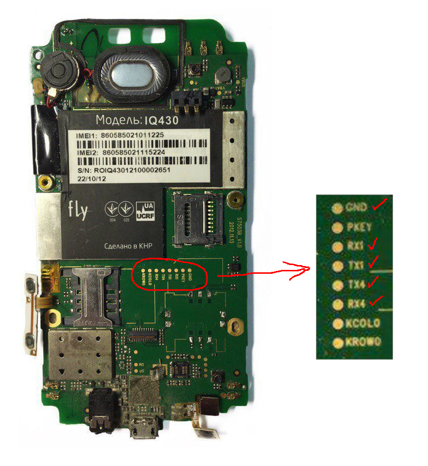
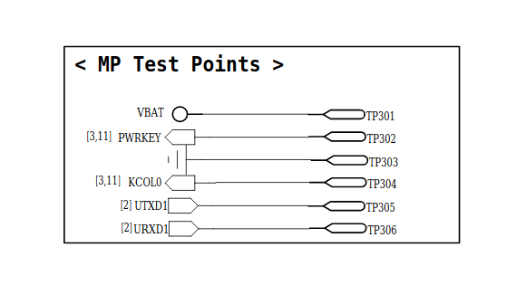
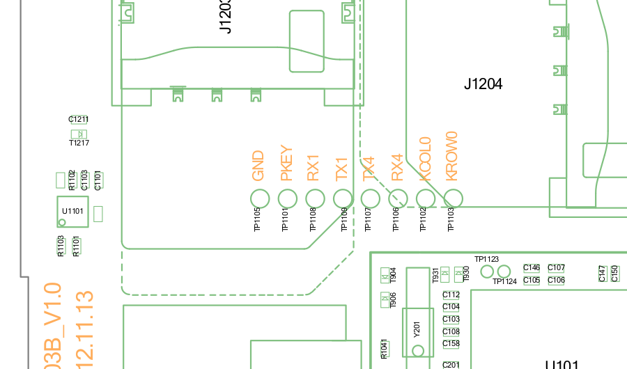

# mt65xx
When I tried to mainline MT6577, I've read tons of forum posts, chat rooms and a lot of guides on the internet. This repository contains my notes, tips and other thoughts which could be useful for bringing support for old Mediatek devices into mainline Linux kernel and relevant development in general. The infomation should be appliable for mt65xx _32-bit_ CPUs running linux kernel v3.4. I have never worked worked on 3.10 and 3.18 kernels. If you have something to add please open a pull request or leave a comment.

# Table of contents
<!--ts-->
* [The state of MT65xx in mainline Linux kernel](#the-state-of-mt65xx-in-mainline-linux-kernel)
* [mt83xx/mt65xx comparison](#mt83xxmt65xx-comparison)
* [Extracting information from the running device](#extracting-information-from-the-running-device)
   * [CPU Operating points](#cpu-operating-points)
   * [GPIO Pins](#gpio-pins)
   * [I2C](#i2c)
   * [LCM (LCD panel / controller model)](#lcm-lcd-panel--controller-model)
   * [PMIC](#pmic)
* [Searching in the source code](#searching-in-the-source-code)
   * [CPU Operating points](#cpu-operating-points-1)
      * [MT6572](#mt6572)
      * [MT6577 + MT6329 PMIC](#mt6577--mt6329-pmic)
   * [Register addresses](#register-addresses)
   * [IRQ (Interrupt request) IDs](#irq-interrupt-request-ids)
* [Working with BootROM / Preloader / Download agents](#working-with-bootrom--preloader--download-agents)
   * [Issues related to the use of virtual machines](#issues-related-to-the-use-of-virtual-machines)
   * [USB devices](#usb-devices)
   * [Booting into the BootROM mode](#booting-into-the-bootrom-mode)
   * [Dumping BootROM](#dumping-bootrom)
* [Debugging over UART](#debugging-over-uart)
   * [1. Visual inspection](#1-visual-inspection)
   * [2. Schematics](#2-schematics)
      * [2.1 General schematics](#21-general-schematics)
      * [2.2 Board schematic / board view file](#22-board-schematic--board-view-file)
   * [3. Asking on the internet](#3-asking-on-the-internet)
   * [Connecting to UART](#connecting-to-uart)
      * [Hardware](#hardware)
      * [Software](#software)
      * [UART description](#uart-description)
      * [Output typical to Boot ROM and Preloader (UART1)](#output-typical-to-boot-rom-and-preloader-uart1)
      * [Output typical to U-Boot and Linux kernel (UART4)](#output-typical-to-u-boot-and-linux-kernel-uart4)
<!--te-->

# The state of MT65xx in mainline Linux kernel
**Only basic hardware works**: CPU cores, generic interrupt controller, timer, UART, (sometimes) watchdog.

There's **no clock driver** for these chipsets which is the most limiting factor as of now. With working clocks, it would be theoretically possible to bring this hardware to life:
* MMC (internal memory and microSD card support)
* I2C (implementing this will make a lot of devices work)
* MIPI subsystem (display stuff)

There's also **no GPIO and pinctrl** stuff for mt65xx. Unless you can write the drivers yourself, do not expect your mainlined device to be of any worth.

# mt83xx/mt65xx comparison

| Chipset | Technology node | Cores | Max frequency        | Core architecture | GPU            | Max screen resolution | Identical to |
|---------|-----------------|-------|----------------------|-------------------|----------------|-----------------------|--------------|
| mt8317  | 40 nm           | 2     | 1.2 GHz              | Cortex-A9         | PowerVR SGX531 | 1280x720              | mt6517       |
| mt8377  | 40 nm           | 2     | 1.2 GHz              | Cortex-A9         | PowerVR SGX531 | 1280x720              | mt6577       |
| mt8389  | 28 nm           | 4     | 1.2 GHz              | Cortex-A7         | PowerVR SGX544 | 1920x1080             | mt6589       |
| mt8312  | 28 nm           | 2     | 1.2 GHz              | Cortex-A7         | Mali-400 MP1   | 1280x720              | mt6572       |
| mt8382  | 28 nm           | 4     | 1.3 GHz              | Cortex-A7         | Mali-400 MP2   | 1280x720              | mt6582       |
| mt8392  | 28 nm           | 8     | 4x2.0 GHz, 4x1.7 GHz | Cortex-A7         | Mali-450 MP4   | 1920x1080             | mt6592       |

# Extracting information from the running device
_It's implied your device has root and busybox, and is connected to your PC via ADB, and the shell is running_

## CPU Operating points
There has to be a way to find voltages required for mainline kernel. As of now, the command below just prints all available CPU frequencies. **All CPU cores must be running for correct output**, start some stress test program. It doesn't matter if it's some Pi value calculator or cryptocurrency miner. Other cores might symlink their frequency list to the first core.
```
busybox find /sys/devices/system/cpu -type f -name 'time_in_state' -print -exec cat '{}' \; | busybox cut -d ' ' -f 1
```
Example output:
```
/sys/devices/system/cpu/cpu0/cpufreq/stats/time_in_state
250250
500500
667333
750750
834166
1001000
1209000
```

## GPIO Pins
_The output seems to be always stripped_
```
cat /sys/devices/virtual/misc/mtgpio/pin
```
Example output:
```
206: 0 0 0 0 1 1 0
207: 1 0 0 0 1 0 0
208: 1 0 0 0 1 0 0
209: 1 0 0 0 1 0 0
210: 1 0 0 0 1 0 0
211: 1 0 1 0 1 0 0
212: 1 0 1 0 1 0 0
213: 1 0 1 0 1 0 0
214: 1 0 1 0 1 0 0
215: 1 0 11|shell@android:/ $
```
Output description ([source](https://4pda.ru/forum/index.php?showtopic=535287&st=2860#entry37284242)):
```
1 [MODE 0 - GPIO]
2 [PULL_SEL (Pullup)]
3 [DIN]
4 [DOUT (output voltage) / 1 - high voltage (1.8V/2.8V..) ,0 - low voltage]
5 [PULL EN (Pull-up enabled)]
6 [DIR (Input on the next direction)(3,4 decision is valid]
7 [INV]
8 [IES]
```

## I2C
The command should list all attached I2C devices on all busses of your device:
```
find /sys/devices/platform/mt*i2c.* -mindepth 2 -name 'driver' -print -exec realpath '{}' \; -exec echo \;
```
Example output:
```
/sys/devices/platform/mt-i2c.0/i2c-0/0-0036/driver
/sys/bus/i2c/drivers/ncp1851

/sys/devices/platform/mt-i2c.0/i2c-0/0-004c/driver
/sys/bus/i2c/drivers/MC32X0
```
Output of this command contains 2 lines for each attached device:
* /sys/devices/platform/mt-i2c.0/i2c-0/0-**0036**/driver ← I2C address (hex)
* /sys/bus/i2c/drivers/**ncp1851** ← Driver name which could hint the actual hardware

## LCM (LCD panel / controller model)
```
cat /proc/cmdline
```
Example outputs:
```
console=ttyMT3,921600n1 vmalloc=320M lcm=1-lg4573b fps=5965 pl_t=582 lk_t=5249
console=ttyMT3,921600n1 vmalloc=506M slub_max_order=0 lcm=1-hx8379a_dsi_vdo_bidirectional fps=5300 pl_t=3466 lk_t=3184
```
See the `lcm=` parameter, remove leading digit and dash. LCM names from example outputs are `lg4573b` and `hx8379a_dsi_vdo_bidirectional` respectively.

## PMIC
This command prints known voltage values in millivolts (mV):
```
busybox find /sys/devices/platform/mt-pmic/ -iname '*volt*' -print -exec cat '{}' \; -exec echo \;
```
Example output:
```
/sys/devices/platform/mt-pmic/LDO_VCAM_AF_VOLTAGE
2800

/sys/devices/platform/mt-pmic/BUCK_VCORE_VOLTAGE
800
```

# Searching in the source code
_It's great if there is a public kernel source code for your SoC. If you have a kernel source code for your exact device model, you can do a bit more. Usually old mediatek kernels have directory structure like [this](https://github.com/rex-xxx/mt6572_x201/tree/f87ef7407576b4fd190c76287e92b2e9886ca484), or [this](https://github.com/arzam16/mt6577_kernel_Acer_B1_A71). Newer kernels have [this](https://github.com/WikoGeek-Unofficial/android_kernel_wiko_mt6577) directory structure. Anyway, the `mediatek/platforrm/mt65xx` directory is what we need._

## CPU Operating points
**Note**: some platforms only list frequencies without voltages. If you know how to find voltage values please let me know.

**Note**: DVFS stands for "Dynamic Voltage Frequency Scaling"

**⚠️ Warning!** Do not forget to convert millivolts to microvolts for DTS!

### MT6572
`mediatek/platform/mt6572/kernel/core/mt_cpufreq.c` has the following macro:
```
#define OP(khz, volt)       \
{                           \
    .cpufreq_khz = khz,     \
    .cpufreq_volt = volt,   \
}
```
Find usages of this macro. Example:
```
static struct mt_cpu_freq_info mt6572_freqs_e1_1[] = {
    OP(DVFS_D3, DVFS_V0),
    OP(DVFS_F1, DVFS_V1),
    OP(DVFS_F2, DVFS_V1),
    OP(DVFS_F3, DVFS_V1),
};
```
Here we can see only constants prefixed with `DVFS_` are used. Search for their definitions:
```
fgrep -I 'define DVFS_' -r mediatek/ 
mediatek/platform/mt6572/kernel/core/include/mach/mt_cpufreq.h:#define DVFS_D0              (1599000)   // KHz, OD
mediatek/platform/mt6572/kernel/core/include/mach/mt_cpufreq.h:#define DVFS_D1              (1404000)   // KHz, OD
mediatek/platform/mt6572/kernel/core/include/mach/mt_cpufreq.h:#define DVFS_D2              (1300000)   // KHz, OD
mediatek/platform/mt6572/kernel/core/include/mach/mt_cpufreq.h:#define DVFS_D3              (1209000)   // KHz, OD
mediatek/platform/mt6572/kernel/core/include/mach/mt_cpufreq.h:#define DVFS_F1              (1001000)   // KHz
mediatek/platform/mt6572/kernel/core/include/mach/mt_cpufreq.h:#define DVFS_F2              (806000)    // KHz
mediatek/platform/mt6572/kernel/core/include/mach/mt_cpufreq.h:#define DVFS_F3              (598000)    // KHz
mediatek/platform/mt6572/kernel/core/include/mach/mt_cpufreq.h:#define DVFS_V0              (1250)  // mV, OD
mediatek/platform/mt6572/kernel/core/include/mach/mt_cpufreq.h:#define DVFS_V1              (1150)  // mV
mediatek/platform/mt6572/kernel/core/include/mach/mt_cpufreq.h:#define DVFS_MIN_VCORE       (1150)
```

### MT6577 + MT6329 PMIC
`mediatek/platform/mt6577/kernel/core/mt_cpufreq.c` has the following macro:
```
#define OP(cpufreq)         \
{                           \
    .cpufreq_mhz = cpufreq, \
}
```
The voltages are not specified here! However, by analyzing this file it's possible to find how Linux kernel interacts with PMIC by writing values which depend on chosen frequency:
```
  if (freq_new == DVFS_F1) ... DRV_WriteReg32(SC_AP_DVFS_CON, ((DRV_Reg32(SC_AP_DVFS_CON) & 0xFFFFFFFC) | 0x00));
  else if (freq_new == DVFS_F2) ... DRV_WriteReg32(SC_AP_DVFS_CON, ((DRV_Reg32(SC_AP_DVFS_CON) & 0xFFFFFFFC) | 0x03));
  else if (freq_new == DVFS_F3) ... DRV_WriteReg32(SC_AP_DVFS_CON, ((DRV_Reg32(SC_AP_DVFS_CON) & 0xFFFFFFFC) | 0x03));
  else if (freq_new == DVFS_F4) ... DRV_WriteReg32(SC_AP_DVFS_CON, ((DRV_Reg32(SC_AP_DVFS_CON) & 0xFFFFFFFC) | 0x03));
```
It's quite similar to how MT6572 (see above) uses one voltage for the highest frequency, and the other voltage for all other frequencies. Most likely `0x00` and `0x03` values mean some voltage setting. Some PDF from the internet says:

_Before the CA9 clock rate speeds up, the software needs to program the external PMIC. VPROC from companion PMIC MT6329 can be programmed by I2C interface, or VPROC can be controlled by pin PMUCTRL1/0 (DVS fast control) from MT6577. Please refer to MT6329 datasheet for detailed programming guides. **There is the 4-step setup by values 0x0, 0x1, 0x2 and 0x3, standing for voltages from low to high**._

But I couldn't figure out what voltage does each value represent.

## Register addresses
Mainlining a device involves writing a Device Tree Source file which requires you to know exact register addresses. Mediatek source code uses _virtual_ register addresses, but DTS needs _physical_ addresses. To solve this, you need to look in `mediatek/platform/mt65xx/kernel/core/include/mach/memory.h` and search for `IO_VIRT_TO_PHYS` macro there.

Example ([source](https://github.com/arzam16/mt6577_kernel_Acer_B1_A71/blob/67a47ce448ed2dad6004f1d5244d5fc26a0907ef/mediatek/platform/mt6577/kernel/core/include/mach/memory.h#L20)):
```
#define IO_VIRT_TO_PHYS(v) (0xC0000000 | ((v) & 0x0fffffff))
```
What this function does is simply replacing the first hexadecimal digit with 'C'. So, if downstream kernel source code lists some register address as `0xF0001234`, then its physical address is just `0xC0001234`. Though there might be more complicated functions.
After virtual to physical address conversion is sorted out, it's safe to continue working on registers. Below are major sources of register addresses:
1. `mediatek/platform/mt65xx/kernel/core/include/mach/mt_reg_base.h` - should list registers for big SoC subsystems
2. `mediatek/platform/mt65xx/kernel/core/include/mach/mt_clock_manager.h` - should contain most of the clock-related registers
3. `mediatek/platform/mt65xx/kernel/core/include/mach/mt_device_apc.h` - DEVAPC (DEVice Automatic Power Control)
4. `mediatek/platform/mt65xx/kernel/core/include/mach/mt_dcm.h`
5. `mediatek/platform/mt65xx/kernel/core/include/mach/mt_cpe.h`
6. `mediatek/platform/mt65xx/kernel/core/include/mach/mt_emi_bm.h`
7. `mediatek/platform/mt65xx/kernel/core/include/mach/mt_emi_bwl.h`
8. `mediatek/platform/mt65xx/kernel/core/include/mach/mt_emi_mpu.h`

Data gathered from the first 2 files is usually enough to boot basic mainline kernel.

## IRQ (Interrupt request) IDs
They are required for various hardware in dts(i), see file `mediatek/platform/mt65xx/kernel/core/include/mach/mt_irq.h`. The addendum of `GIC_*_SIGNALS` is the IRQ number, example:
```
#define MT_TS_IRQ_ID    (GIC_PRIVATE_SIGNALS + 21)
                                               ^^--- IRQ ID
```

# Working with BootROM / Preloader / Download agents
## Issues related to the use of virtual machines
* **⚠️ Warning!** If you are using Virtual Box above v6 with USB passthrough to interact with BootROM / Preloader / DAs you might encounter a performance issue that slows down reconnecting your device from host to guest. It must happen *very* fast but due to the bug it doesn't and the bootloader reaches timeout faster than the handshake is completed. Older versions of VirtualBox such as v5 do not have this issue.
* Device connects as USB 2.0 so if you're using Virtual Box, corresponding Extension Pack is required.
* (Linux only) If VirtualBox doesn't detect any USB devices at all, make sure the current user is in `vboxusers` group.

## USB devices
Below is the table of the common VID/PIDs used by Mediatek devices. If you are using a VM with USB passthrough to interact with BootROM / Preloader / DAs you must configure Host->Guest autoreconnect. In VirtualBox you can do this by creating a filter for each device.

| VID  | PID  | Purpose        |
|------|------|----------------|
| 0e8d | 0003 | BootROM        |
| 0e8d | 2000 | Preloader      |
| 0e8d | 2001 | Download agent |

**Note**: There *are* other VID/PIDs used by modern devices and their values depend on specific manufacturer. These 3, however, should be enough for 99% of mt65xx devices.

## Booting into the BootROM mode
For some reasons you might want to use BootROM mode instead Preloader mode.

1. **☢️☢️☢️ WARNING: MAKE A BACKUP FIRST ☢️☢️☢️** The one-size-fits-all way to get into the BootROM mode is to corrupt the preloader stored in the internal memory (PRELOADER partition). You can do this in variety of ways:
   * Write some random data to the start of the PRELOADER partition. Though even 1 kB is enough I tend to overwrite the whole partition. If your device is rooted you can do it right there with `dd`. Otherwise you can always rely on proprietary SP Flash Tool (enable Advanced Mode and look for "Write Memory" tab) or FLOSS software such as mtkclient.
   * Format the whole internal storage. Try to avoid this option as you're risking losing NVRAM and other important stuff.
2. Some devices boot into BootROM when some key is held. Usually it's one of the volume keys.
3. Some devices enter BootROM mode when connected to PC without a battery.

## Dumping BootROM
Read [brom-dump/README.md](brom-dump/README.md).

# Debugging over UART
UART is one of the best tools for gathering information and even communicating with your device. Usually a single SoC has multiple UARTs for various purposes. For example, one of UARTs could be used to control the wireless hardware (Wi-Fi, Bluetooth, GPS, Radio...). Despite its advantages, there are several drawbacks. First, there's need to tear down the device to access UART. Second, you will need a soldering iron with thin tip and some good flux, _and_ skills to use them. Third, most Mediatek devices have UART pins exposed on the motherboard, however identifying them might not be the easiest task. I will go through some ways to find UART pads, Fly IQ430 (MT6577) will be used as an example.

## 1. Visual inspection
There's a chance the motherboard of your device has labels for important pads. Look for "TX", "RX" labels. I've seen some boards having the most straightforward and obvious labeling: "UART_0_TX", "UART_0_RX". Fly IQ430 motherboard does have labels on it:



## 2. Schematics
Where you can download a schematics for your device for free is whole different topic and won't be discussed here. However if you are out of luck, try asking in the ["#offtopic" chat of postmarketOS](https://wiki.postmarketos.org/wiki/Matrix_and_IRC), additionally you can ping/mention me (look for arzamas-16 nickname), there's a chance of me being able to fetch the desired schematic for you.

### 2.1 General schematics
Usually they are less informative and more generic. [This is how they look like](images/tinno-s7503b-sch.png). Just search for 'UART' or 'TX' and check the results. For example, Fly IQ430 general schematic doesn't specify the exact location of UART, and doesn't even give any clear pointers to where could it be. Some boards have alphanumeric labels on them, and general schematics could point to required pads.



### 2.2 Board schematic / board view file
Those are the best schematics one could have. Not only they show the exact placement of components and pads, they can also list these components, so if you screw something up, you can search for a replacement part. Boardview files require special software to open them ([OpenBoardView](https://github.com/OpenBoardView/OpenBoardView) is Free/Libre Open Source Software, and works quite good), and it can also show how internal components are connected with each other. Very nice!

Just like with general schematics, search for UART-related stuff such as "UART" or "TX". Fly IQ430 board schematic tells us the exact location and names of UART pads, **but** notice how the board is flipped horizontally:


## 3. Asking on the internet
_Some_ devices might have interesting approaches to exposing UARTs such as using 3.5mm audio jack output or microUSB connector pads. Search it up on the internet.

## Connecting to UART
### Hardware
**Please do not use PL2303HX USB dongles** from AliExpress/Banggood/Wish. They are super cheap, but also they are fake because Prolific doesn't produce these chips anymore, official sources:
1. [Warning Letter on Counterfeit Products](http://www.prolific.com.tw/US/ShowProduct.aspx?p_id=155&pcid=41)
2. [PL2303 End-of-life notice](http://www.prolific.com.tw/US/ShowProduct.aspx?p_id=212&pcid=41)

Not only you will get counterfeit and unstable hardware, but you can also do great damage to your device. I recommend using USB dongles based on **FT232RL**, they don't cost much, they support high baudrates and 1.8 V logic levels, and they just don't die out of sudden like fake PL2303-based converters.

**At least 2 connections are mandatory**: the TX pad and the GND pad. Sometimes there's a UART voltage supply pad on the board, but I've never used it myself, so I'd say it's safe to not use it at all.

In 95% of cases **the "TX" pad of your device has to be connected to the "RX" pin of your USB-UART dongle**. "RX" pad of your device goes to "TX" on the dongle.

For dumping early boot logs on downstream kernel **connecting just a TX pad is enough**. Use RX pad for communicating your device which runs mainline kernel to access shell.

### Software
On Linux, you are free to use literally anything you'd like to. I prefer `picocom`. On Windows `PuTTY` is usually recommended by the folks on the internet.

As for baudrate, it's either 115200 or 921600 depending on the purpose of UART you've connected to.

### UART description
UART labels and identifiers on Mediatek devices are not standardized, but there are some common patterns:
1. UART1 (TX1/RX1) is used by the Boot ROM and Preloader. Runs at 115200 baud.
2. UART2 (TX2/RX2) is used directly by the SoC for controlling the hardware on the board. Baud rate differs. Might not be exposed on the board.
3. UART3 (TX3/RX3) is used directly by the SoC for controlling the hardware on the board, usually it's the wireless connectivity chip. Often it's not exposed on the board.
4. UART4 (TX4/RX4) is used by the Preloader, and U-Boot, and Linux kernel for logging output. Runs at 921600 baud. Gets set up by U-Boot upon booting the device.

### Output typical to Boot ROM and Preloader (UART1)
A few lines right after powering on the device. Output can be very verbose while the device is being flashed via SP Flash Tool.
```
RP: 0000 0000 0000

F2: 3000 00A0
F3: 0000 0000
RP: 0000 0000
V0: 0000 0000 [0001]
V1: 0000 0000 [0003]
V2: 0000 0000 [0009]
00: 0000 0000

READY
```

### Output typical to U-Boot and Linux kernel (UART4)
Following lines are printed by the **Preloader** after the device is powered on:
```
[i2c_init] Start...................
[i2c_set_speed] Set sclk to 99 khz (orig: 100 khz)
[i2c_set_speed] I2C Timing parameter sample_cnt_div(0),  step_cnt_div(61)
[i2c_init] Done

[pmic6329_init] Start...................
```
After these lines you could also see the DRAM calibration table, and the EMMC partition layout table.

**U-Boot log** might begin with:
```
[LCM Auto Detect], we have 1 lcm drivers built in
[LCM Auto Detect], try to find driver for [unknown]
[LCM Specified]	[ej070na]
[mtkfb] LCM TYPE: DPI
[mtkfb] LCM INTERFACE: SERIAL
[mtkfb] LCM resolution: 1024 x 600
[PROFILE] ------- i2c init takes 1 ms -------- 
UB wdt init
[LEDS]LK: leds_init: mt65xx_backlight_off 
[LEDS]LK: mt65xx_backlight_off 
[LEDS]LK: lcd-backlight level is 0 
[LEDS]LK: backlight_set_pwm:duty is 0
[PROFILE] ------- led init takes 15 ms --------
```
U-Boot logs contain the list of partitions on EMMC, clock setup, display initialization output, and other messages related to showing the boot logo, charging (not always! some devices handle charging in Linux kernel), checking the signatures and headers. The last lines of U-Boot log look like these:
```
[PROFILE] ------- boot_time takes 1804 ms -------- 
booting linux @ 0xa08000, ramdisk @ 0x4a00000 (594282)
[LEDS]LK: leds_deinit: LEDS off 
lk boot time = 1804 ms
lk boot mode = 0
lk finished --> jump to linux kernel
```
**Linux kernel log** starts with this line:
```
[   0.000000] (0)[0:swapper]Linux version 3.4.0 (marsl_lin@BM-1) (gcc version 4.6.x-google 20120106 (prerelease) (GCC) ) #1 SMP PREEMPT Tue Apr 2 19:19:54 CST 2013
```
