# Dumping BootROM
*Some assembly required.*

# Table of contents
<!--ts-->
* [Dumping mt6589 BROM](#dumping-mt6589-brom)
   * [Obtaining SP Flash Tool](#obtaining-sp-flash-tool)
   * [Capturing USB traffic of SP Flash Tool and UART output](#capturing-usb-traffic-of-sp-flash-tool-and-uart-output)
   * [Reverse engineering the Download Agent](#reverse-engineering-the-download-agent)
   * [Patching Download Agent](#patching-download-agent)
   * [Hello, world!](#hello-world)
   * [Figuring out I/O API](#figuring-out-io-api)
   * [The usb-dump payload](#the-usb-dump-payload)
* [Dumping mt6573 BROM](#dumping-mt6573-brom)
   * [SP Flash Tool issues](#sp-flash-tool-issues)
   * [UART issues](#uart-issues)
   * [reset_uart_and_log](#reset_uart_and_log)
* [chaosmaster's generic_dump](#chaosmasters-generic_dump)
   * [Function prologue](#function-prologue)
   * [LDR instruction](#ldr-instruction)
   * [Decoding LDR instruction bytes](#decoding-ldr-instruction-bytes)
   * [Fixing and defining the usbdl_put_data](#fixing-and-defining-the-usbdl_put_data)
   * [Sending the data](#sending-the-data)
* [chaosmaster's generic_uart_dump](#chaosmasters-generic_uart_dump)
<!--te-->

# Dumping mt6589 BROM
Initially this part was meant to be more of a blog post than a clear and concise guide. I will eventually publish everything I used but please do not expect any common sense to be present here especially if you are actually experienced in reverse engineering and baremetal programming.

Dumping BootROM on modern Mediatek family (mt67xx) SoCs is quite a trivial task because we have [mtkclient](https://github.com/bkerler/mtkclient) that works in nearly automatic mode.

For slightly older devices we can always rely on modified generic payloads from the [bypass_payloads](https://github.com/chaosmaster/bypass_payloads) repository.

However, for some reason even properly coded generic UART dump payload has never worked for me on mt6589. It felt like some hardware was either not initialized at all or initialized in some wrong way. Judging by Github commits no one has publicly shared mt6589 BROM dump at the time I started working on it so I decided to take a deeper look into what could I do.

## Obtaining SP Flash Tool
As we know, Mediatek developed their proprietary flashing software called SP Flash Tool. Its workflow could be approximated to something like the following:
1. Establish a connection with a target device (either via UART or USB). Connection can be made with devices booted into BROM and Preloader modes.
2. Identify the device and perform some very basic hardware setup procedure that depends on the target SoC using a small set of commands.
3. Extract a Download Agent for target SoC from `MTK_AllInOne_DA.bin`. Download Agent is a program compiled for specific SoC that provides rich set of commands and allows SP Flash Tool to perform ROM/RAM init, flashing etc.
4. Push Download Agent to target's SRAM at specific offset.
5. Jump to Download Agent.
6. Wait till DA performs HW initialization and sends first data back to SP Flash Tool (DRAM info, partition table etc.).
7. Execute commands to performs user-defined tasks (Formatting / Flashing / Memory test etc.)

My idea is to obtain the original DA for my SoC and make it execute my code right after initializing the on-board hardware.

I started by searching the oldest available SP Flash Tool build for Linux that still supported mt6589. By the time first Linux support was added to SPFT its developers already started dropping code for older platforms. For example, mt6575 and mt6577 were among the first to get their support removed from SPFT though their DAs remained in a few later versions of `MTK_AllInOne_DA.bin`. The first search result led me to the [download page at spflashtool.com](https://spflashtool.com/download/) where I got the archive with the Linux variant of SP Flash Tool v5.1648. Worth mentioning the website is tricky because it doesn't want us to access archives via direct links. Instead, it runs a script to add an event listener that appends a special request header on clicking the link. If you access the direct link without this header you will get redirected to the main page.

By the way, the Linux version is more useful than the Windows one because the `libflashtoolEx.so` has debug symbols unlike its Windows counterpart :)

```
libflashtoolEx.so: ELF 64-bit LSB shared object, x86-64, version 1 (SYSV), dynamically linked, BuildID[sha1]=b570d3c0871606769140884647696f12d864c9b7, with debug_info, not stripped
```

## Capturing USB traffic of SP Flash Tool and UART output
After spending a few minutes on libpng-12 and udev errors I got SP Flash Tool to work on my computer. My next goal was to capture its USB traffic to be able to replay it later. In SPFT I loaded a scatter file for my device and added one Readback entry starting from 0x0 with length of 0x1000. *Here I omit the part about killing the PRELOADER partition on my device to get into the BROM mode*, though at this point it *should* work even with Preloader mode. I initialized usbmon with `modprobe usbmon` and fired up Wireshark. I also connected my device to UART to capture output on this bus, too.

The captured data can be split into a few parts for better understanding:
1. USB endpoint configuration.
2. BROM handshake.
3. SoC identification.
4. Basic HW setup.
5. DA push and execution.
6. Readback flow.

BROM commands are very well documented already by other folks so I won't describe them in detail and for steps 1-3 I will re-use code from [bypass_utility](https://github.com/MTK-bypass/bypass_utility). For step 4 I will analyze captured traffic and replay it programmatically verbatim *even if some commands make no sense* just to ensure absolute compatibility with SP Flash Tool flow.

For step 5 I needed to carve out the mt6589 DA first. Looking at the traffic capture made it trivial to find same bytes in `MTK_AllInOne_DA.bin` and extract the needed binary.

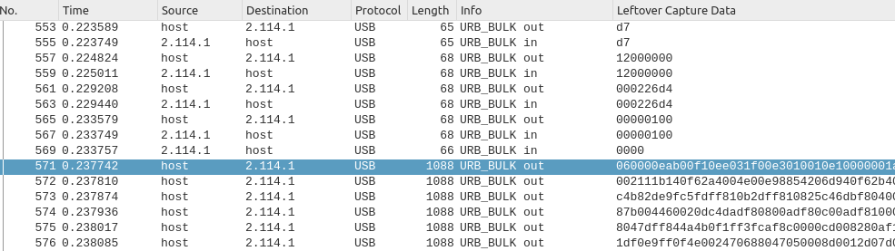

```
7z x -so "SP_Flash_Tool_v5.1648_Linux.zip" "SP_Flash_Tool_v5.1648_Linux/MTK_AllInOne_DA.bin" |\
    tail -c +767137 | head -c 141012 \
    > "mt6589-da-original.bin"
```

Of course I could have used [cyrozap's kaitai struct](https://github.com/cyrozap/mediatek-lte-baseband-re/blob/master/SoC/mediatek_download_agent.ksy) but:
1. I could not be arsed to fix Kaitai Web IDE issues in Firefox (it didn't open big files at the time of writing)
2. Back when I worked on mt6577 I remember `MTK_AllInOne_DA.bin` having older format that this kaitai struct did not support. As it turned out this struct should work with mt6589 but I didn't test it because see point 1.

With the original DA for mt6589 I can now try replaying the traffic and pushing it myself. For this matter I came up with what later became the `spft-replay` program. I based it on [bypass_utility](https://github.com/MTK-bypass/bypass_utility) by Dinolek and chaosmaster and repurposed it to suit my needs. The first thing I removed was Windows support and its DLLs :P The next thing to go was Preloader mode handling as I am working only with BROM. I also took an attempt at refactoring and reformatting the code. I doubt I succeeded at this because I don't use any IDE and rely solely on `isort`, `ruff` and `black`.

I decided to go the path of least resistance and did not implement traffic replay past the point after the device jumps to DA and sends some initial data (this part is highlighted on the picture below).

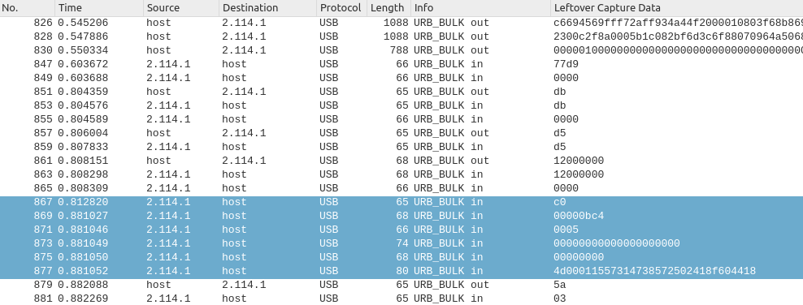

With UART hooked up to my device I pushed the original DA I carved out from Wireshark dump and watched for console output. Surprisingly it worked and printed the following lines:

```
Output Log To Uart 4
InitLog: 10:54:54 26000000 [MT6589]
GetNandID(), m_nand_acccon=0, m_chip_select=0
[SD0] Bus Width: 1
[SD0] SET_CLK(260kHz): SCLK(259kHz) MODE(0) DDR(0) DIV(193) DS(0) RS(0)
1501004D, 38473157, 41022557, 1844608F,
```

In other words, before the DA requests more data from SP Flash Tool it successfully prints those lines. Now I need to find a place where I can patch in a jump to my code.

## Reverse engineering the Download Agent
I loaded the original DA into Ghidra:

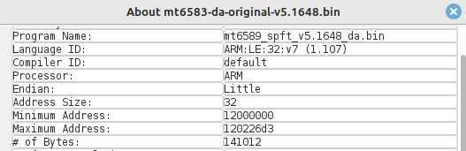

I searched for the usages of the string `Output Log To Uart 4` and Ghidra jumped to `FUN_12004088` which I renamed to `init_log` for conveniece. Then I jumped to `FUN_12003f7c` because it clearly is some `print` function. Looking at its contents in decompiler leaves no doubt it's `printf`. I renamed `FUN_12003f7c` to `printf_uart`.

Analyzing outgoing call tree of `printf_uart` revealed a few useful functions. I mapped them on the picture below after giving them normal names.

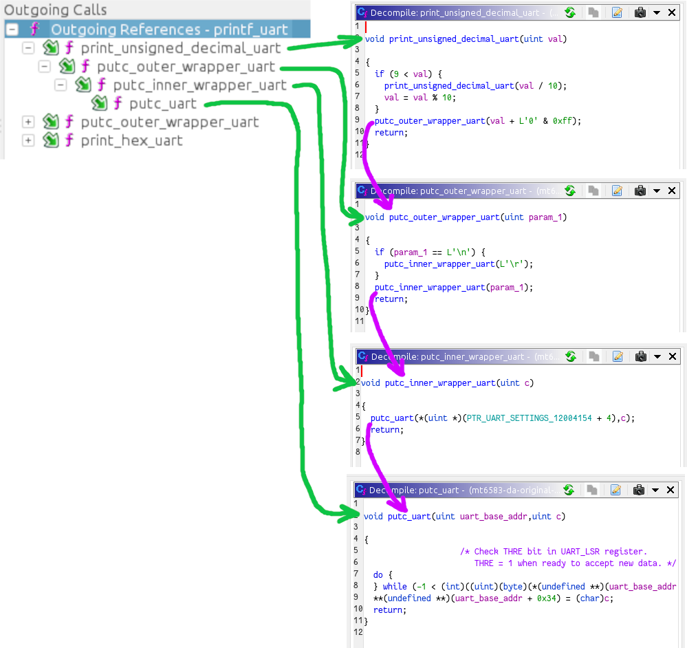

Lets get back to `init_log`. The first XREF of this function seems to be a goldmine - it looks like a global init function (`FUN_12001be8` renamed to `init`) that runs many initialization routines before jumping into the command loop (`FUN_120016d6` renamed to `command_loop`). This could be super useful in the future.

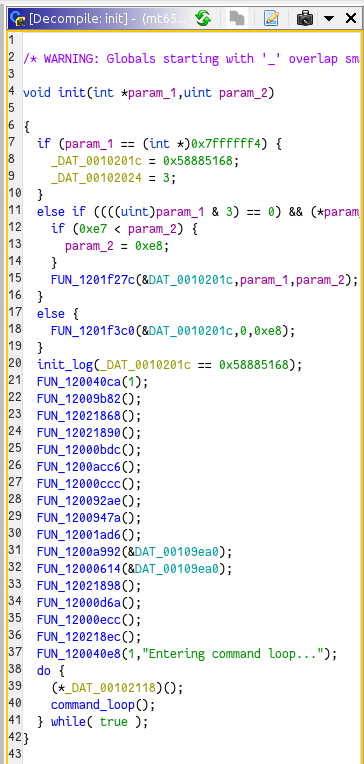

The last line printed on UART console looks like it was a printf format string. Large amount of parentheses makes me think so and I confirmed it by looking at `FUN_12013426` which I renamed to `set_sd_clk`. I did not understand how to configure the Function Call Graph tool to show all possible call trees between `init` and `set_sd_clk` so I opened the "Incoming Calls" pane of the Function Call Trees tool and entered `init` in the filter field:

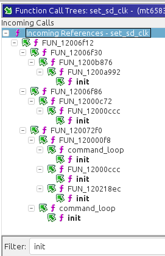

All `set_sd_clk` invokations stemming from `command_loop` execute way too late, and DA does not reach such code after receiving just the initial data after jumping to DA.

Now there are just 4 different call trees originating from `init` left. I need to find the function after `init` that gets executed first. I opened `init` in disasm and looked at functions listed in the Incoming Calls tree:

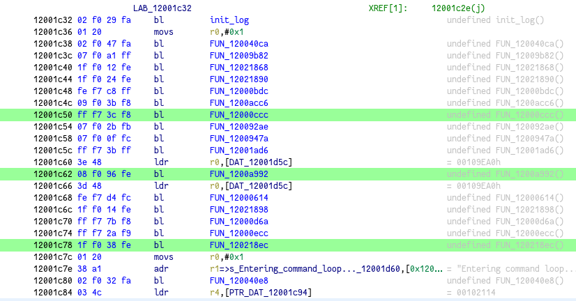

Looking at the addresses of the `BL` instructions it is obvious `FUN_12000ccc` is executed first and at some point this function causes the `[SD0] SET_CLK(260kHz): ...` line to be printed on UART. I opened `FUN_12000ccc` in decompiler and instantly noticed values similar to those in Wireshark.

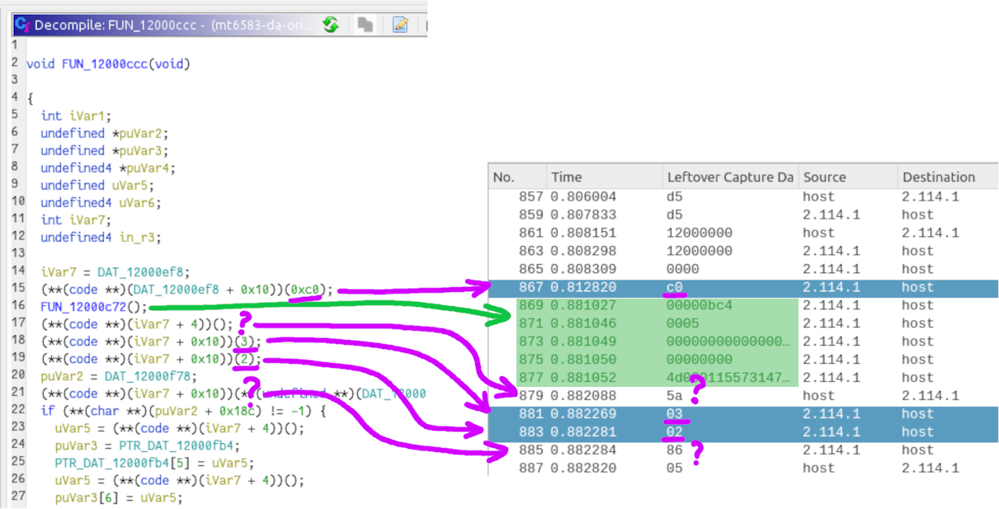

At this point it's obvious that `FUN_12000c72` generates 5 separate transfers highlighted in green color. I will keep the `FUN_12000c72` call and patch the next one to jump to custom payload. The payload will be appended to the end of the original DA and it should be small enough to fit into SRAM. The original mt6589 DA is 141012 (0x226D4) bytes long and since we count bytes from 0 the last byte is 141011 (0x226D3) so our payload will start at 141012th byte.

## Patching Download Agent
Ghidra's "Patch Instruction" is quite inconvenient to use so I fired up [Online ARM to HEX converter](https://armconverter.com/). Of course I could have used tools like r2 and others but why should I when I have the online converter...

The instruction that jumps to custom payload will be located at `0x12000cda` and I pasted this value into the "Offset (hex)" field on webpage. The assembly code is trivial: `BL 0x120226d4`. I copied THUMB bytes (`12f0fbfc`) because the parent function is in Thumb mode.

Right now I'm planning to compile my first custom payload completely in Thumb mode because I plan to use some functions from DA that are Thumb and they also return to Thumb mode.

To not patch same instructions in other places (there are many byte sequences of `60688047` in the binary) I will extend to search pattern to include the previous instruction that will remain untouched. I don't really know how do professionals patch binary files and went with simple `xxd` and `sed` workflow:

```
xxd -c 256 -p "mt6589-da-original.bin" |\
    sed -e "s/fff7ccff60688047/fff7ccff21f0fbfc/" |\
    xxd -p -r \
    > "mt6589-da-patched.bin"
```

## Hello, world!
For starters, I decided to write a small payload that will use DA functions I found to print a few test values. There's nothing outstanding about it and you can check the source in the `payloads/hello-world-uart-da-api.s` . However there are few interesting points worth noting.

First, right after jumping we must reset all registers and stack pointer to guarantee proper execution flow. This is done in `payloads/init.s` - this file is compiled in such a way that the code is put into a separate `.text.init` section. Later I will tell `ld` to always put this section at start of the custom payload. After registers are cleared the init routine jumps to the main code.

Second is the `ld` script I wrote. My binary targets bare metal target and I use the `arm-none-eabi` toolchain [v11.2-2022.02 from ARM Developer](https://developer.arm.com/downloads/-/arm-gnu-toolchain-downloads) to build it. At the beginning of script I define the only available memory sector that starts at ( (DA memory offset)+(custom payload offset) ). This way `ld` understands there is no read-only memory. Since I'm building for bare-metal there is no crt0 to perform common basic initialization such as copying sections from RO memory to RWX memory and zero-filling the `.bss` section. In fact, DA has already initialized not only its own sections but also set up essential hardware. As there is no RO memory everything left to do is to initialize the `.bss` section with zeroes. Of course I could implement some algorithm in `.text.init` section but as I'm going the path of least resistance I limited the max payload size to `0x200` bytes and made `ld` fill unused space with zeroes thus imitating already initialized `.bss` section. Resulting piggyback binaries will always be `0x200` bytes long but it's always possible to adjust the size.

The piggyback then is appended to patched DA file resulting in ready-to-use payload for `spft-replay`.

```
cat "mt6589-da-patched.bin" "mt6589-hello-world-uart-da-api-piggyback.bin" \
    > "mt6589-hello-world-uart-da-api-payload.bin"
```

I connected my device to UART console and pushed the payload:

```
spft-replay.py "mt6589-hello-world-uart-da-api-payload.bin"
```

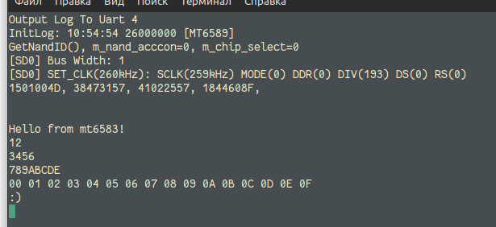

Success! My next step is to implement proper code for dumping BROM.

## Figuring out I/O API
*I'm sure there's much better way to do things I'm about to do but I lack experience. If you are experienced in Ghidra get ready to cringe.*

Previously I found some calls in `FUN_12000ccc` for USB I/O operations.  They are referenced to as an offset to an address stored in `DAT_12000ef8`.

The address is `0x00102114`. In *MT6589 HSPA+ Smpartphone Application Processor datasheet / Version: 1.0 / Release date: 2012-12-11* on page 44 we can see the `0x0010_0000 - 0x0010_FFFF` region belongs to On-Chip SRAM.

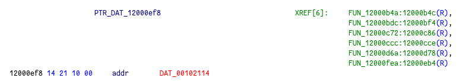

This pointer has only 6 references and jumping to the first one in the list reveals a function (`FUN_12000b4a`, later renamed to `setup_io_ops`) that seems to setup a variety of function pointers depending on the value of `param_1` (renamed to `io_type`). It's clear to me that `io_type` indicates either UART or USB because DA has no other way to communicate with PC.

For me it seems like `puVar1` in the decompiler window means usage of a struct to store said I/O function pointers. I renamed `PTR_DAT_12000ef8` to `ptr_io_ops`. Each branch of `if` statement sets 15 different pointers relative to `ptr_io_iops`.

I created a 60-byte struct called `io_ops_s` but it looks like I made a mistake somewhere because changing the type of `puVar1` from `undefined *` to `io_ops_s *` does nothing but prints some bullshit warning atop of the function in decompiler window:

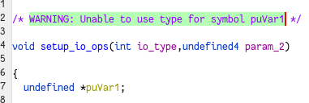

Instead, I created a `0x3c` bytes long uninitialized RW memory region at `0x102114` and set its type to `io_ops_s`. This makes it much easier to inspect usages of each pointer. It took me some time to figure out what each function in `io_ops_s` does, here's a very brief rundown:

1. `(off)` Init transport HW. Is used only in `FUN_12000bdc` (renamed to `init_io`).
2. `(off + 0x4)` Read 1 byte and return it
3. `(off + 0x8)` Read 1 byte into a buffer
4. `(off + 0xC)` Read N bytes `read(char* dst, uint len)`
5. `(off + 0x10)` Write 1 byte
6. `(off + 0x14)` Write N bytes `write(char* data, uint len)`
7. `(off + 0x18)` Write 1 byte but unused..?
8. `(off + 0x1C)` Read 2 bytes
9. `(off + 0x20)` Write 2 bytes
10. `(off + 0x24)` Read 4 bytes
11. `(off + 0x28)` Write 4 bytes
12. `(off + 0x2C)` Read 8 bytes
13. `(off + 0x30)` Write 8 bytes
14. `(off + 0x34)` Activate transport features (ignored for USB)
15. `(off + 0x38)` Set transport baudrate (ignored for USB)

## The usb-dump payload
After pointing out all the I/O functions I took their addresses and implemented a rather simple `usb-dump` payload in assembly that will dump hardcoded set of regions using newly found functions in DA. I chose to dump not only the BootROM but also whole SRAM and the DA itself as it now has many variables initialized. Could be useful for further reverse engineering.

In `spft-replay` I implemented the "receive mode" to save dumped regions to disk. There's also "greedy mode" I made mainly for debugging.

```
[2023-03-25 02:19:01,737] <REPLAY> -> DA: (OK) 5A
[2023-03-25 02:19:01,740] <INFO> Waiting for custom payload response
[2023-03-25 02:19:01,743] <INFO> Received HELLO sequence
[2023-03-25 02:19:01,749] <INFO> Reading 65536 bytes
[2023-03-25 02:19:05,216] <INFO> Saved to dump-1.bin
[2023-03-25 02:19:05,225] <INFO> Reading 65536 bytes
[2023-03-25 02:19:08,704] <INFO> Saved to dump-2.bin
[2023-03-25 02:19:08,715] <INFO> Reading 262144 bytes
[2023-03-25 02:19:22,479] <INFO> Saved to dump-3.bin
[2023-03-25 02:19:22,485] <INFO> Received GOODBYE sequence
[2023-03-25 02:19:22,486] <INFO> Closing device
```

Success! Now I've got the dump of mt6589 BROM, SRAM and DA.

Assembly is cool but when it comes to supporting more SoCs with different core types it gets much harder to maintain code. Considering this I took the following measures:
1. Rewrote 2 existing payloads in C. They will compile in A32 mode without optimizations and GCC will take care of calling DA APIs which are mostly T32.
2. Built init code as A32.
3. Changed DA patch from using `BL` instruction to `BLX`.
4. Bumped piggyback size to 0x800 bytes. This is 4 times more than the original but should be enough for whatever GCC outputs.

# Dumping mt6573 BROM

This SoC has ARM1176JZF-S core and if I wanted to keep writing in assembly I would definitely have had some issues regarding code compatibility. Having stuff written in C makes it GCC's headache, not mine.

My workflow to add mt6573 support will be similar to mt6589:
1. Capture SP Flash Tool traffic
2. Carve out the original DA
3. Teach `spft-replay` the traffic of mt6573
4. Patch original DA to make it jump to my code
5. ...
6. PROFIT!!!

## SP Flash Tool issues
My mt6573 device is old. Its on-board storage is NAND, not EMMC. Same version of SP Flash Tool I used for mt6589 successfully consumed a scatter for NAND but refused to do anything immediately after pushing DA. Looks like this version of software doesn't support NAND.

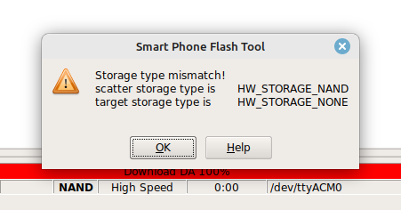

I know SP Flash Tool for long enough to understand what kinds of bullshit can it generate. For example, having such an ouroboros is totally possible:

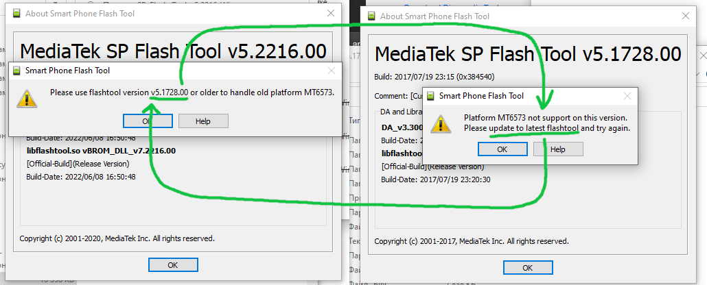

The `MTK_AllInOne_DA.bin` found in the Linux distribution of SP Flash Tool v5.1648 **does** support mt6573:

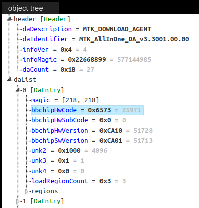

Looks like the NAND support depends on host SPFT application, not on DA itself. I started my Windows computer (the only reason for this is there are more archive versions for Windows than for Linux) and began testing SP Flash Tool distributions older than v5.1648 but I shoved them the DA from v5.1648. It took me some time to figure out that the latest version of SP Flash Tool for Windows that supports mt6573 with NAND is v5.1624.

I set up Wireshark and USBPcap and shortly after got the traffic dump I was looking for. The dumped traffic allowed me to carve out the original DA for mt6573 and implement support for this SoC in `spft-replay`.

Adding support for mt6573 in payloads was just a matter of finding some function addresses in its original DA and putting them into header files, as well as adding a new target to Makefile.

Unfortunately, things didn't go as well as expected. Despite USB dump payload working properly the "Hello world" payload doesn't print anything at all. I will fix it next.

## UART issues
When I run the readback flow in the original SP Flash Tool I *do* see the UART logs:

```
Output Log To Uart 4
InitLog: 10:53:14 61440000 [MT6573]
Page size in device is 2048
[RS] (9001B234: 4DC8)
[LIB] Security PreProcess : 16:08:11, Nov  9 2016
[LIB] Flash Detect Results : (0x0, 0xC4D, 0xC4F)
[LIB] Search NAND
[LIB] ROM_INFO not found in NAND
...
(snip)
```

The first line printed after `init_log` is called is `Page size in device is 2048` and it's printed in `FUN_9000b0ee` (renamed to `request_storage_settings`). This function seems to request NAND init parameters (56 bytes) from SPFT in a loop (response is `0x69` to try the next param) until suitable ones are detected (response is `0x5A`). The parent function seems to perform some kind of storage initialization, I renamed this function to `init_storage`.

I returned to the `init_log` function and noticed it has 2 references. I generated a graph:

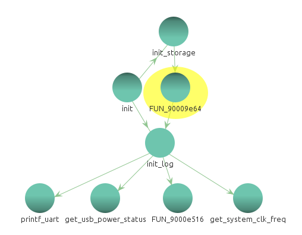

Turns out I was really close because `init_storage` calls something that invokes `init_log` just before requesting NAND init params and printing the `Page size in device is 2048` line.

## reset_uart_and_log
After inspecting this function (`FUN_90009e64`, renamed to `reset_uart_and_log`) and its outgoing calls it became clear that on mt6573 the first `init_log` call is kinda ignored and printing stuff to UART won't work until `reset_uart_and_log` is called by `init_storage`.

Now I just need to add this call to my `hello-world-uart` payload and it should work. Aaand...

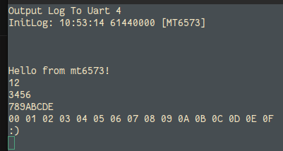

... *ta-da!* The introduced call doesn't seem to harm the mt6589 variant of payload so I decided to not guard it with `#ifdef TARGET_MT6573` but kept the appropriate Makefile change for setting a `TARGET_MTxxxx` for future.

# chaosmaster's generic_dump
The `generic_dump` payload found in the [bypass_payloads](https://github.com/chaosmaster/bypass_payloads/blob/master/generic_dump.c) is quite an interesting solution worth explaining.

Not only it's a small and effective payload but it also has on-the-fly disassembly technique implemented.

The idea of this payload is to derive a pointer to the table of I/O functions similar to [those described above](#figuring-out-io-api) and use it to call `usbdl_put_data(uint32_t* src, uint32_t len)` providing the base address of the BROM and its size.

To better illustrate what's really going on, I will use the BROM dump from [MT8382V](https://github.com/arzam16/SoC-BootROMs/blob/main/mediatek/mt8382v.bootrom.bin). This SoC shares the same registers with MT**65**82. I loaded this dump into Ghidra and set the base address to 0x0:


## Function prologue
Various families of Mediatek SoCs have different locations of BROM. This code scans predefined set of supposed addresses ( `uint32_t brom_bases[]` ) for a first address that has specific pattern defined in `uint16_t search_pattern[]`.

```
__attribute__ ((section(".text.main"))) int main() {
	send_word = 0;
	uint32_t i = 0;
	for (i = 0; i < (sizeof(brom_bases) / sizeof(*brom_bases)); ++i) {
		send_word = (void *)searchfunc(brom_bases[i] + 0x100, brom_bases[i] + 0x10000, search_pattern, 4);
		if (send_word) break;
	}
```

This pattern is a *function prologue* - a small routine put by the compiler in the beginning of the function. In our case it saves values of registers to stack.

It's very important to understand the function prologues **do** differ, it's just a really good coincidence this one is found in majority of BROMs. But how do we dump the BROM if we don't know the exact byte pattern? In this case we can dump it over UART. It is not as convenient as USB dump but it should work on all Mediatek devices. More on this in the next chapter.

Since the searched function is supposed to be in Thumb mode, we scan 16-bit sequences instead of 32-bit. The function prologue defined in `search_pattern[]` disassembles to this code:

```
2d e9 f8 4f     push       {r3,r4,r5,r6,r7,r8,r9,r10,r11,lr}
80 46           mov        r8,r0
8a 46           mov        r10,r1
```

Lets search this signature in Ghidra. In the source code the `search_pattern[]` values are big endian, we have to account for that. It's important to separate each 16-bit value with spaces otherwise Ghidra will treat it as a single huge number instead of a set of values.

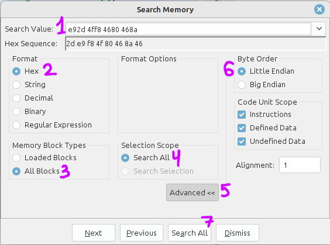

In case of MT8382 BROM the search yielded 2 results but since the `searchfunc` returns the address of the first result the `send_word` variable is going to take the value of `0xA49E + 1 = 0xA49F`. 1 is added to properly indicate that function as Thumb code:

```
if (++matched == patternsize) return offset | 1;
```

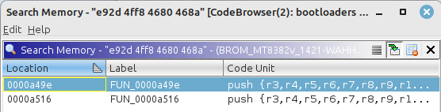

Lets jump to the first search result, too.

## LDR instruction
If we look at the disassembly listing we will see the following:

```
0000a49e 2d e9 f8 4f     push       {r3,r4,r5,r6,r7,r8,r9,r10,r11,lr}
0000a4a2 80 46           mov        r8,r0
0000a4a4 8a 46           mov        r10,r1
0000a4a6 55 48           ldr        r0,[DAT_0000a5fc]
0000a4a8 87 68           ldr        r7,[r0,#0x8]=>DAT_001027c8
0000a4aa c6 68           ldr        r6,[r0,#0xc]=>DAT_001027cc
```

The ARM processor has 12 general-purpose registers for storing data. They are somewhat similar to variables we see in programming languages.

Lets focus on the `ldr` instructions:
1. The first `ldr` instruction puts whatever value is stored at the address `0x0000a5fc` into register `r0`. This value is an address of the table of BROM I/O functions.
2. The second `ldr` instruction takes a value at `r0`, adds `0x8` to it and loads a value from the resulting address into register `r7`.
3. The third `ldr` instruction takes a value at `r0`, adds `0xc` to and and loads a value from the resulting address into register `r6`.

In the decompiler window we can see the C-pseudocode equivalent of said instructions:

```
pcVar2 = *(code **)(DAT_0000a5fc + 8);
pcVar1 = *(code **)(DAT_0000a5fc + 0xc);
```

## Decoding LDR instruction bytes
In `generic_dump` there's following code. I reformatted it for better understanding

```
int (*(*usbdl_ptr))() = (void *)(
	ldr_lit(
		(uint32_t)send_word + 7,
		((uint16_t*)(send_word + 7))[0],
		0
	)
);
```

The `ldr_lit` function returns an absolute address referenced by the `ldr` instruction. It takes the address of an `ldr` instruction and its bytes. In our case the needed `ldr` instruction is stored at `prologue address + 7 = 0xA4A6`, and its bytes are `0x5548` as seen in Ghidra. The Ghidra representation of Hex is big-endian and we have to account for that. In fact the processor is little-endian and first reads `0x48` then `0x55`. The last argument is `0` and is not used.

To understand what the code in `ldr_lit` function actually does we have to understand how said `LDR` instruction is encoded. Here's an excerpt from the [ARM7 TDMI Manual](https://web.archive.org/web/20221211173239/http://bear.ces.cwru.edu/eecs_382/ARM7-TDMI-manual-pt3.pdf), page 16:

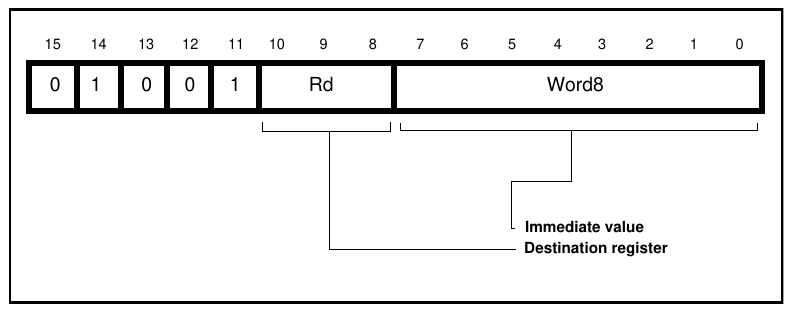

The first line in `ldr_lit` extracts the `imm8` part of the instruction. The actual value is 10 bit long but it's able to store it in an 8-bit because 2 bits are always zero as the target address must be aligned by 4 which means 0th and 1st bit are always zero. The `imm8` value in our case is `0x55`.

```
uint8_t imm8 = instr & 0xFF;
```

The next line extracts the ID of a register (0~12) and writes it to a variable. However in our case we don't need to know the exact destination register and this `if` branch is not executed.

```
if (Rt) *Rt = (instr >> 8) & 7;
```

The next line rounds the Program Counter register value *downwards* by 4. The `curpc` variable stores the address of our `ldr` instruction. In Thumb mode instructions can fit into 16-bytes but `ldr` wants 4-bytes alignment.

```
uint32_t pc = (((uint32_t)curpc) / 4 * 4);
```

an alternative way to do this would be:

```
uint32_t pc = curpc & ~0b11; // clear the first 2 bytes
```

As result, `pc` value is `0xA4A6 / 4 * 4 = 0xA4A4`.

The next line does the following:
1. First, it extends the `imm8` from 8 to 10 bytes by multiplying it by 4. It is the same thing as shifting it left by 2. The value in brackets is `(0x55 * 4) = (0x154)`.
2. We add 4 because the manual says so: "*The value of the PC will be 4 bytes greater than the address of this instruction*".
3. Everything is added up to form an address where the BROM I/O table pointer is stored at.

```
return (uint32_t *)(pc + (imm8 * 4) + 4);
```

As result, `ldr_lit` returns `(0xA4A4 + 0x154 + 4) = 0xA5FC`.

`0xA5FC` is the address that holds an address (so, a pointer) to the BROM I/O table. We can check in Ghidra our calculations were correct:

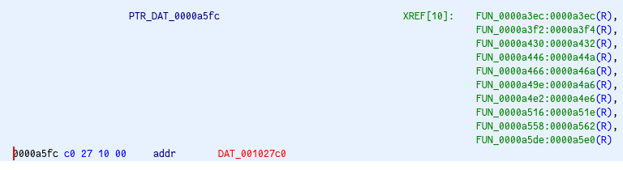

When `ldr_lit` returns an address it is casted to an array of functions:

```
int (*(*usbdl_ptr))() = (void *)(ldr_lit(...));
```

## Fixing and defining the usbdl_put_data
I must admit the MT8382 example is quite bad because the provided dump does not have a SRAM dump where the actual function table is located. In general, it lists pointers to various functions just like the Download Agent [does](#figuring-out-io-api) but just a little bit different. This BROM has the following table:
1. `(off)` some USB function
2. `(off + 0x4)` some USB function
3. `(off + 0x8)` `write(char* data, uint len)`
4. `(off + 0xC)` `flush()`
5. `(off + 0x10)` some USB function
6. `(off + 0x14)` some USB function

The next line of code overwrites the I/O function table once to fix a pointer to the `write` function. It might be not all Mediatek BROMs need that fix, though.

```
//Fix ptr_send
*(volatile uint32_t *)(usbdl_ptr[0] + 8) = (uint32_t)usbdl_ptr[2];
```

The part of code defines a C helper function called `usbdl_put_data` for sending arbitrary data to PC using the I/O functions. First the function calls the `write` function (`usbdl_ptr[2]` takes the 3rd function from the table) and then flushes the USB buffer, completing a transfer (`usbdl_ptr[3]` takes the 4th function from the table).

```
int usbdl_put_data(void* data, uint32_t size) {;
	(usbdl_ptr[2])(data, size);
	return (usbdl_ptr[3])();
}
```

## Sending the data
The following line defines a magic value with forced big-endianness:

```
int ack = __builtin_bswap32(0xC1C2C3C4);
````

If `__buildin_bswap32` wasn't used the PC would have received `0xC4C3C2C1` instead.

The next line sends the magic value. This payload is meant to be used with [bypass_utility](https://github.com/MTK-bypass/bypass_utility) and the program *does* [expect this value](https://github.com/MTK-bypass/bypass_utility/blob/87a2541820ad22e7cc00d0bd51a3a8faff6c21ef/main.py#L110). Once the program receives `0xC1C2C3C4` it starts receiving `0x20000` bytes from USB and saving them to disk. The payload, in its turn, dumps the whole BootROM:

```
usbdl_put_data((void *)brom_bases[i], 0x20000);
```

The payload then attempts to shutdown the device by triggering the hardware watchdog and entering an infinite loop that will be interrupted when watchdog resets the device on timeout.

```
// Reboot device, so we still get feedback in case the above didn't work
wdt[8/4] = 0x1971;
wdt[0/4] = 0x22000014;
wdt[0x14/4] = 0x1209;

while (1) {

}
```

# chaosmaster's generic_uart_dump
Running this payload allows dumping memory without relying on location of I/O functions table in BROM. Mediatek SoCs use the same HW IP for UART and usually only the base register addresses differ. It's easy obtain them by analyzing the kernel source code or reading a datasheet.

`uart_base` should of the UART used by BROM (usually UART1) to avoid using uninitialized ports.

This payload reads the specified memory region byte-by-byte and prints each byte in HEX-encoded form using the `low_uart_put` function.

`uart_reg0` is a status register and the `while` loop is here to wait until the 5th bit (`0x20`) is set which means the FIFO buffer is ready to accept new data.

Once the wait cycle is complete the byte is written to the `uart_reg1` register.
