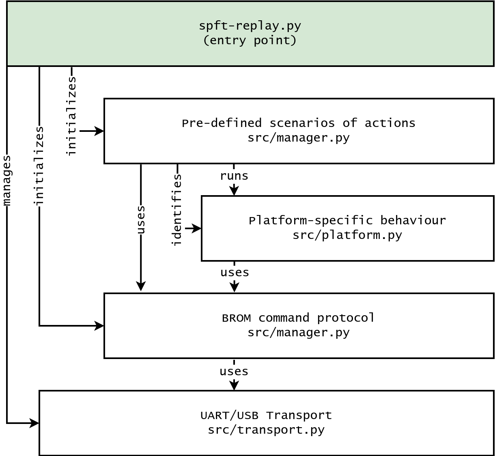

### spft-replay: execute arbitrary payloads on Mediatek devices.

spft-replay is based on the `bypass_utility` program originally made by **Dinolek** and **chaosmaster**. The idea of this program is to replay USB traffic generated by the proprietary Mediatek flashing software SP Flash Tool v5.1648 (Linux) in order to push user-specified payload to device and execute it.

Usually old Mediatek devices from the mt65xx family do not enforce digital signatures and link authorization so in theory it's possible to execute arbitrary code with the highest privileges. The original SP Flash Tool software pushes so-called Download Agents (DAs) that provide rich functionality for flashing devices.

### Differences from the original bypass_utility:
* Works only with devices in BROM mode (VID/PID 0E8D:0003).
* No kamakiri support.
* No Windows support.

### Supported platforms (traffic replay & payloads)
* mt6252
* mt6573
* mt6577 / mt8317
* mt6580
* mt6582 / mt8382
* mt6589 / mt8389

All non listed mt62xx platforms *may* work in **identification mode only**.

All non listed mt65xx platforms *must* work in **identification mode**. They *should* work in **simple payload mode** given a properly built standalone payload is provided.

### Project structure
`spft-replay.py` is the entry point of `spft-replay` program. It sets up a DeviceManager (`src/manager.py`) that executes a specified scenario ("identify", "send payload") for a specific platform (`src/platform.py`) using the Mediatek BROM protocol (`src/brom.py`) over some transport (`src/transport.py`).

### License
MIT.
